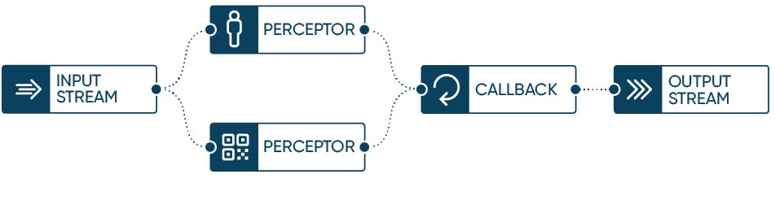

# Darcy AI Engine

Darcy AI Engine is a Python library that makes building AI apps as easy as building any other type
of app. AI Engine exposes high-level constructs ([`InputStream`](https://darcyai.github.io/darcyai/input-streams/inputstream/),
[`Perceptor`](https://darcyai.github.io/darcyai/perceptors/perceptor/), `Callback`,
[`OutputStream`](https://darcyai.github.io/darcyai/output-streams/outputstream/))
that you assemble in a `Pipeline` with a few lines of Python.

To get started, see the [Build Guide](https://docs.darcy.ai/docs/guides/build/), look
at the [examples](./src/examples), and consult
the [Python reference docs](https://darcyai.github.io/darcyai/).

## Issues, Contributing, Discussion

If you discover issues with AI Engine, view the [issues](https://github.com/darcyai/darcyai/issues),
or create a new one. You can also submit a [Pull Request](https://github.com/darcyai/darcyai/pulls),
or join the [discussions](https://github.com/darcyai/darcyai/discussions). 
